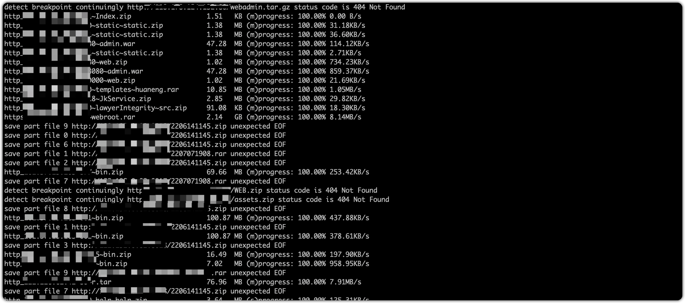

## 简介

> 下载器

## 使用

```bash
$ ./collector
Usage of ./collector:
  -folder string
    	file save location (default "./files")
  -max-retry int
    	after a failed download, the maximum number of attempts (default 10)
  -thread int
    	batch write on and chunked download threads (default 10)
  -timeout int
    	the connection times out, and the download time defaults to 2 hours (default 10)
  -url string
    	specify URL to download
  -url-file string
    	get URL from specified file for batch download
```

1. 下载

   ```bash
   ./collector -url http://x.x.x.x:xxx/htdocs.zip
   ```

2. 批量下载

   ```bash
   ./collector -url-file /tmp/urls.txt
   ```



## 实现

> 启动工具
> 
> 请求判断是否支持断点续传(最大读取10byte)
>
> 不支持断点续传，则直接下载整个文件
>
> 支持断点续传，则分组多线程下载，最后合并文件
>
> 如果下载失败，则进行重试

## TODO

- [x] 断点续传

- [x] 多线程下载

- [x] 文件重命名 http://x.com:80/web/web.zip -> http_x.com-80~web~web.zip

- [x] 最大失败重试次数

- [x] 进度条

